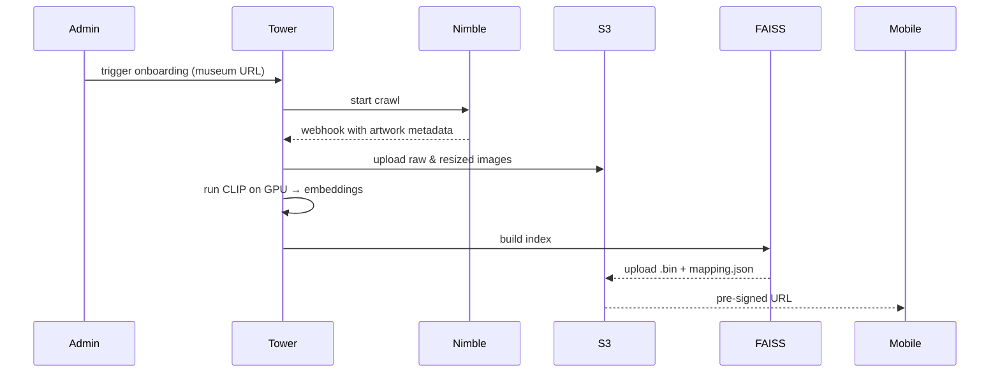

# 🎨 Museum.Bingo – AR Scavenger Hunt for Cultural Spaces

**Turn any museum into an interactive, AI‑powered bingo adventure.**

[](https://devpost.com)
[](https://opensource.org/licenses/MIT)
[](https://reactnative.dev/)
[](https://tower.dev)

---

## 📖 Table of Contents

1. [Overview](#overview)
2. [Features](#features)
3. [Architecture Diagram](#architecture-diagram)
4. [Tech Stack](#tech-stack)
5. [Project Structure](#project-structure)
6. [Prerequisites](#prerequisites)
7. [Installation & Setup](#installation--setup)
   - [Backend (Node.js + Firebase)](#backend-nodejs--firebase)
   - [Mobile App (React Native)](#mobile-app-react-native)
   - [Tower Pipelines](#tower-pipelines)
8. [Configuration](#configuration)
9. [API Reference](#api-reference)
10. [Database Schema (Firestore)](#database-schema-firestore)
11. [Real‑time Multiplayer with WebSockets](#real-time-multiplayer-with-websockets)
12. [AI Model Deployment (CLIP + FAISS)](#ai-model-deployment-clip--faiss)
13. [Testing](#testing)
14. [Deployment](#deployment)
15. [Troubleshooting](#troubleshooting)
16. [Contributing](#contributing)
17. [License](#license)

---

## Overview

**Museum.Bingo** is a mobile application that transforms passive museum visits into a playful, social scavenger hunt. Visitors receive a bingo card with visual prompts (e.g., *“Painting with a dog”*, *“Sculpture that looks uncomfortable”*). Using the phone’s camera and on‑device AI (CLIP), the app recognises artworks in real time, validates tiles, and updates a multiplayer leaderboard. AR features include animated bingo chips, a compass‑based “heat vision” hint system, and plane‑aware virtual confetti upon completing a row.

This project was built for the **DeveloperWeek New York 2026 Hackathon** under the **name.com – Domain Roulette** challenge, leveraging **Nimble** for live web data, **Tower** for serverless Python pipelines, and **Firebase** for real‑time state.

---

## Features

| Feature | Description |
|---------|-------------|
| 📸 **Real‑time artwork recognition** | On‑device CLIP (quantized MobileCLIP) matches camera frames against pre‑computed embeddings. |
| 🎯 **Animated bingo chip** | GPU‑accelerated chip drop with sound and haptic feedback when an artwork is validated. |
| 🔥 **Heat vision (AR hint)** | Compass arrow overlaid on the camera feed, pointing to the nearest unvalidated artwork using iBeacons / Wi‑Fi RTT. |
| 🎉 **Virtual confetti** | ARKit/ARCore plane detection makes confetti particles land on the real floor when the player gets Bingo. |
| 👥 **Multiplayer rooms** | Create or join a room; everyone sees the same bingo card; real‑time leaderboard via WebSockets + Firebase. |
| 🌍 **Multilingual UI** | On‑device translation (Google ML Kit) of bingo prompts and artwork descriptions (English, Spanish, French, German, Chinese). |
| 🗣️ **Voice commands** | “Validate tile 3”, “Give me a hint”, “Show leaderboard” – integrated with speech recognition and TTS. |
| 📊 **Museum analytics** | Tower pipelines aggregate anonymised visitor behaviour to help museums improve engagement. |
| 🏅 **Gamification loop** | Scan → tile validation → points → streaks / badges / rank updates with celebration UI. |

---

## Architecture Diagram

Below is a high‑level architecture of Museum.Bingo. (Mermaid diagram – viewable on GitHub.)

```mermaid
graph TB
    subgraph "Mobile App (React Native)"
        A[Camera + VisionCamera] --> B[Frame Processor]
        B --> C[CLIP Model (On‑device)]
        C --> D[FAISS Index (Embeddings)]
        D --> E[Artwork Recognized]
        E --> F[Update Bingo Tile]
        F --> G[WebSocket Client]
        H[Heat Vision UI] --> I[Indoor Positioning (iBeacons)]
        I --> G
        J[AR Confetti] --> K[ARKit/ARCore]
    end

    subgraph "Backend (Node.js + Firebase)"
        L[Firestore] --> M[(Museums, Users, Rooms)]
        N[Realtime Database] --> O[Leaderboard Cache]
        P[Socket.IO Server] --> G
        Q[Firebase Auth] --> R[User Sessions]
    end

    subgraph "Data Pipeline (Tower + S3)"
        S[Admin Onboarding] --> T[Nimble Crawl]
        T --> U[Raw Images → S3]
        U --> V[CLIP Embedding (GPU)]
        V --> W[FAISS Index]
        W --> X[Index Upload to S3]
        X --> D
    end

    subgraph "External APIs"
        Y[Nimble API]
        Z[Google Places API]
        AA[Stripe]
    end

    style A fill:#f9f,stroke:#333,stroke-width:2px
    style V fill:#bbf,stroke:#333
```

---

## Tech Stack

| Layer | Technology |
|-------|-------------|
| **Mobile Frontend** | React Native (TypeScript), VisionCamera v4, Skia, Reanimated, ML Kit, Firebase SDK |
| **Backend** | Node.js (Express), Firebase Admin SDK, Socket.IO |
| **Databases** | Firestore (persistent), Firebase Realtime Database (ephemeral leaderboards), Redis (optional) |
| **AI & Embeddings** | MobileCLIP (quantized TFLite), FAISS, Sentence‑Transformers |
| **Data Pipeline** | Tower (serverless Python), Nimble API, S3 (AWS / MinIO) |
| **AR** | ARKit (iOS), ARCore (Android) – via native modules |
| **Voice** | `@react-native-voice/voice`, `expo-speech` |
| **Authentication** | Firebase Auth (Google, Apple, email) |
| **Payments** | Stripe (subscriptions) |
| **Geolocation** | Google Places API, `react-native-geolocation`, iBeacon scanning |

---

## Project Structure

```
museum-bingo/
├── backend/
│   ├── src/
│   │   ├── config/           # Firebase, Stripe, Nimble setup
│   │   ├── models/           # Firestore schemas
│   │   ├── routes/           # Express endpoints
│   │   ├── services/         # Leaderboard, multiplayer, translation
│   │   ├── websocket/        # Socket.IO server
│   │   └── server.ts
│   ├── functions/            # Firebase Cloud Functions
│   ├── package.json
│   └── tsconfig.json
├── mobile/
│   ├── src/
│   │   ├── ai/               # CLIP model loader, FAISS binding
│   │   ├── components/       # BingoCard, Leaderboard, HeatVisionOverlay
│   │   ├── screens/          # CameraScreen, MultiplayerLobby, GameScreen
│   │   ├── services/         # IndexDownloader, Voice, Translation
│   │   ├── store/            # Zustand stores (bingo, multiplayer)
│   │   └── App.tsx
│   ├── android/              # Native Android (ARCore bridge)
│   ├── ios/                  # Native iOS (ARKit bridge)
│   ├── package.json
│   └── metro.config.js
├── pipelines/
│   ├── nimble_crawl.py       # Tower pipeline: crawl museum website
│   ├── image_processing.py   # Download, resize, upload to S3
│   ├── clip_embedding.py     # Run CLIP on GPU, produce embeddings
│   ├── build_faiss_index.py  # Create FAISS index, upload to S3
│   └── incremental_update.py # Add new artworks to existing index
├── docs/
│   ├── api.md
│   ├── schema_diagram.png
│   └── mock_data/            # 10 pages of JSON mock data
├── .env.example
├── docker-compose.yml        # For local Redis, S3 (MinIO)
├── README.md
└── LICENSE
```

---

## Prerequisites

- **Node.js** v18+ and npm/yarn
- **React Native** environment (iOS: Xcode 14+, Android: Android Studio)
- **Firebase** project (Blaze plan recommended for Cloud Functions)
- **Tower CLI** (for pipeline deployment)
- **Nimble API** key (free tier available)
- **Stripe** account (for testing, use test keys)
- **AWS S3** bucket (or MinIO for local dev)

---

## Installation & Setup

### Backend (Node.js + Firebase)

```bash
cd backend
npm install
cp .env.example .env   # Fill in Firebase, Stripe, Nimble keys
npm run build
npm run dev            # Starts server on port 3000
```

**Firebase Emulators** (optional, for local testing):
```bash
npm run serve          # Starts Firestore, Auth, Functions emulators
```

### Mobile App (React Native)

```bash
cd mobile
npm install
cd ios && pod install && cd ..
npm run ios            # or npm run android
```

**Environment variables** for mobile: create `.env` with:
```
API_URL=http://localhost:3000
FIREBASE_API_KEY=...
GOOGLE_PLACES_API_KEY=...
```

### Tower Pipelines

Install the Tower CLI and authenticate:

```bash
pip install tower-cli
tower login
cd pipelines
tower deploy --all
```

Set up webhooks in Tower dashboard to point to `https://your-backend.com/webhooks/tower`.

### Local S3 with MinIO (development)

```bash
docker-compose up -d minio
# Create buckets: museum-bingo-raw-images, museum-bingo-resized, museum-bingo-indices
```

---

## Configuration

| Variable | Purpose |
|----------|---------|
| `FIREBASE_PROJECT_ID` | Firebase project identifier |
| `FIREBASE_PRIVATE_KEY` | Service account private key |
| `FIREBASE_CLIENT_EMAIL` | Service account email |
| `NIMBLE_API_KEY` | Nimble web data API key |
| `TOWER_API_KEY` | Tower API key |
| `STRIPE_SECRET_KEY` | Stripe secret key (test or live) |
| `AWS_ACCESS_KEY_ID` / `AWS_SECRET_ACCESS_KEY` | For S3 |
| `REDIS_URL` | Optional Redis for additional caching |

All backend variables are loaded via `dotenv`. Mobile variables are embedded via `react-native-config`.

---

## API Reference

### Public Endpoints (prefix `/api`)

| Method | Endpoint | Description | Auth |
|--------|----------|-------------|------|
| POST | `/auth/register` | Register new user | – |
| POST | `/auth/login` | Firebase ID token exchange | – |
| GET | `/museums/nearby` | List museums within radius | Bearer |
| POST | `/multiplayer/create` | Create a multiplayer room | Bearer |
| POST | `/multiplayer/join` | Join existing room | Bearer |
| POST | `/multiplayer/:roomId/validate` | Mark tile as completed | Bearer |
| GET | `/multiplayer/:roomId/leaderboard` | Get current leaderboard | Bearer |
| POST | `/payments/create-checkout` | Stripe checkout session | Bearer |
| POST | `/webhooks/stripe` | Stripe webhook (no auth) | – |
| POST | `/webhooks/tower` | Tower pipeline completion | – |

Full API documentation in [`docs/api.md`](docs/api.md).

---

## Database Schema (Firestore)

### `users/{userId}`

```json
{
  "uid": "string",
  "displayName": "string",
  "email": "string",
  "isPremium": "boolean",
  "totalBingos": "number",
  "createdAt": "timestamp"
}
```

### `museums/{museumId}`

```json
{
  "name": "string",
  "location": "GeoPoint",
  "bingoPrompts": "string[][]",
  "embeddingIndexVersion": "number",
  "indexS3Key": "string"
}
```

### `multiplayer_rooms/{roomId}`

```json
{
  "museumId": "string",
  "ownerId": "string",
  "bingoCard": "string[][]",
  "status": "waiting|playing|finished",
  "players": {
    "userId": { "displayName": "string", "score": "number", "completedTiles": "string[]" }
  },
  "createdAt": "timestamp"
}
```

### `game_sessions/{sessionId}`

```json
{
  "userId": "string",
  "museumId": "string",
  "startTime": "timestamp",
  "endTime": "timestamp?",
  "completedTiles": "string[]",
  "score": "number"
}
```

Firestore indexes are defined in `firestore.indexes.json`.

### Gamification collections

The gamification layer expects (or simulates in local demo mode) the following collections:

- `userStats/{userId}` – lifetime totals (badges, scans, best streak, bingos, museums completed)
- `bingoSessions/{sessionId}` – per-session progress and score snapshots
- `roomScores/{roomId}_{userId}` – realtime room leaderboard entries with speed tie-break metadata
- `achievements/{userId}/earned/{achievementId}` – unlocked badges with `earnedAt`, `tier`, and display metadata
- `scanEvents/{eventId}` – structured event log (`tile_validated`, `hint_used`, `badge_unlocked`, `bingo_completed`, `room_joined`, `leaderboard_updated`, `scan_failed`)
- `dailyChallenges/{dateKey}` – daily museum prompt set and bonus reward configuration

Type definitions for these documents are in `docs/mock_data/gamification-types.ts`.

---

## Real‑time Multiplayer with WebSockets

The backend uses **Socket.IO** to broadcast tile updates and leaderboard changes to all clients in a room.

**Client connection:**

```javascript
import io from 'socket.io-client';
const socket = io(API_URL);
socket.emit('join-room', { roomId, userId, displayName });
socket.on('tile-completed', ({ userId, tileId, newScore }) => {
  // Update UI
});
socket.on('leaderboard-update', (leaderboard) => {
  // Refresh leaderboard
});
```

**Server event flow:**

- `join-room` – adds client to a Socket.IO room and subscribes to RTDB listeners.
- `tile-validated` – updates RTDB scores, then broadcasts to the room.
- `disconnect` – removes client, optionally cleans up after timeout.

RTDB structure:

```
/rooms/{roomId}/scores/{userId} : number
/rooms/{roomId}/progress/{userId}/{tileId} : boolean
```

Gamification sync flow for tile validation:

1. Update local state immediately (points, streak, tile completion).
2. Emit realtime room score update (`tile_validated`) for leaderboard/rank movement.
3. Persist structured event for analytics aggregation.
4. Re-sort leaderboard by points, then completion speed as tie-breaker.

---

## AI Model Deployment (CLIP + FAISS)

### On‑device CLIP

- Model: **MobileCLIP‑S2** (quantized to int8) converted to TensorFlow Lite.
- Input: 224×224 RGB image, normalized with CLIP stats.
- Output: 512‑dim embedding.
- Size: ~12 MB, loaded once per session.

### FAISS Index

- Index type: `IndexFlatIP` (inner product, equivalent to cosine similarity after normalization).
- Built on Tower GPU instance using all artwork embeddings.
- Serialized and uploaded to S3 as `faiss_index.bin`.
- Mobile app downloads the index (≈50 MB for 2000 artworks) and performs ANN search offline.

### Embedding Generation Pipeline (Tower)



This pipeline runs **once per museum** and incrementally updates when new artworks are added.

---

## Testing

### Backend Unit Tests (Jest)

```bash
cd backend
npm test
```

### Mobile Tests (Detox + Jest)

```bash
cd mobile
npm run test:e2e
```

### Load Testing (Artillery)

```bash
cd backend
npm run load-test   # Simulates 100 concurrent multiplayer users
```

---

## Deployment

### Backend (Firebase Cloud Functions + Cloud Run)

```bash
cd backend
npm run deploy
```

### Mobile (App Store / Play Store)

- iOS: `cd ios && fastlane beta`
- Android: `cd android && ./gradlew bundleRelease`

### Tower Pipelines (Production)

```bash
tower deploy --env prod
```

### Monitoring

- Firebase Crashlytics & Analytics
- Tower logs & metrics dashboard
- CloudWatch for S3/Redis (if using AWS)

---

## Troubleshooting

| Issue | Solution |
|-------|----------|
| Camera not showing | Check permissions; ensure `react-native-vision-camera` is linked. |
| FAISS index download fails | Verify S3 bucket policy allows pre‑signed URLs; check `expiresIn`. |
| CLIP model not loading on older Android | Use `loadTensorFlowModel` with `delegate: 'gpu'` fallback to CPU. |
| WebSocket connection drops | Enable sticky sessions if using multiple server instances (or use Firebase Realtime Database directly). |
| AR confetti not appearing | Ensure ARKit/ARCore permissions; plane detection may require good lighting. |

For more help, check [GitHub Issues](https://github.com/museum-bingo/museum-bingo/issues) or join our [Discord](https://discord.gg/example).

---

## Contributing

We welcome contributions! Please read our [CONTRIBUTING.md](CONTRIBUTING.md).

1. Fork the repository.
2. Create a feature branch (`git checkout -b feature/amazing-feature`).
3. Commit your changes (`git commit -m 'Add some amazing feature'`).
4. Push to the branch (`git push origin feature/amazing-feature`).
5. Open a Pull Request.

---

## License

Distributed under the MIT License. See `LICENSE` for more information.

---

**Built with 💙 for museums, developers, and bingo lovers everywhere.**  
*Museum.Bingo – where every gallery is a game board.*
