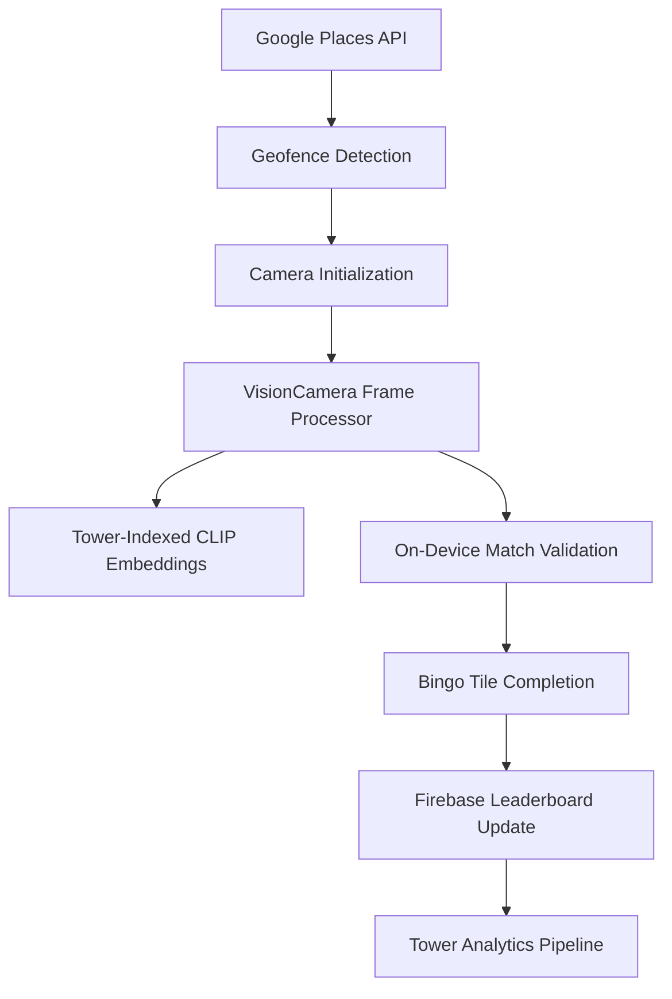

# 10-Page Research Document: Vision Camera for Museum.Bingo

**Technology:** `react-native-vision-camera`  
**Integration into Project:** AR Artwork Validation for `museum.bingo`  
**Hackathon Track:** Domain Roulette (name.com) + Nimble + Tower

## Page 1 - Executive Summary: The Vision Layer of Museum.Bingo

Museum.Bingo's core gameplay loop depends on **live camera validation** - a user points their phone at an artwork, the app recognizes the piece, and a bingo square is marked. The `react-native-vision-camera` (VisionCamera) library is the foundation upon which this feature is built. It provides the low-latency camera feed, frame processing pipeline, and integration with on-device machine learning needed to make artwork recognition feel instantaneous.

VisionCamera v4+ is the most advanced camera library in the React Native ecosystem, rebuilt on **Nitro Modules** for near-native performance. It offers three capabilities essential to Museum.Bingo:

- **High-performance frame processing** - Raw camera buffers (YUV/RGB) can be processed in real-time via JavaScript worklets, with zero-copy memory management.
- **GPU-accelerated rendering and transformation** - Frames can be resized, cropped, and converted to ML-ready formats without touching the CPU.
- **Extensible plugin architecture** - Custom frame processors can run CLIP embeddings, object detection, or any other ML model, either via JavaScript or native C++ code.

This research synthesizes the library's architecture, feature set, performance characteristics, and integration pathways, with specific attention to how it will be deployed in the 13-day hackathon window.

## Page 2 - Core Architecture: Nitro Modules and the Pipeline Model

VisionCamera v4+ abandons the traditional React Native Bridge in favor of **Nitro Modules**, a high-performance C++ bridge that allows synchronous, type-safe communication between JavaScript and native code (Swift/Kotlin) with minimal overhead. The library follows a layered, unified architectural pattern centered on `HybridObject` - native objects that are directly accessible from JavaScript.

The central orchestrator is the **`CameraSession`**, which manages the hardware capture pipeline, while the **`CameraController`** provides fine-grained control over focus, zoom, and exposure without restarting the session. This separation ensures that the camera feed can be live and stable while parameters are adjusted dynamically.

### Data Pipeline Architecture

VisionCamera uses a "plug-and-play" output architecture. Instead of the session knowing about specific outputs, it manages a collection of `CameraOutput` objects. The developer declares which outputs are needed (Preview, Frame, Photo, Video, Depth), and the `CameraSession` negotiates the best hardware configuration to satisfy all constraints simultaneously.

This constraint-based negotiation is critical for Museum.Bingo, where the same camera feed must simultaneously:

- Display a live preview to the user.
- Stream frames to a frame processor for CLIP embedding inference.
- Potentially capture a photo for logging or sharing.

The pipeline operates across **three dedicated native threads**, keeping the UI fully responsive:

1. **Camera Thread** - Hardware configuration and session management.
2. **Video/Frame Thread** - Processing of heavy pixel buffers.
3. **JS/Runtime Thread** - Execution of frame processor worklets.

### Platform Abstraction

VisionCamera abstracts away iOS (AVFoundation) and Android (CameraX/Camera2) differences behind a single TypeScript API. In v4.0, the Android implementation was fully rewritten to use **CameraX** with its "stream sharing" feature, dramatically improving stability across diverse hardware. This means Museum.Bingo will behave consistently on iPhones, high-end Android devices, and older Samsung or Huawei phones alike.

## Page 3 - Declarative Camera API and Hooks

The `Camera` component is the primary entry point for rendering a live preview and managing the camera session lifecycle. It is implemented as a `PureComponent` to prevent unnecessary re-renders of the heavy native session.

### Core Component Props

| Prop | Purpose in Museum.Bingo |
|------|--------------------------|
| `device` | The physical camera device (selected via `useCameraDevice()`) |
| `isActive` | Start/stop the hardware session - preserves battery when the validation UI is hidden |
| `constraints` | Configures FPS, resolution, and scanning preferences |
| `outputs` | An array of output hooks (preview, frame, photo, video) |

### CameraRef and Imperative Methods

Interaction with the camera is handled via a ref of type `CameraRef`:

```typescript
const camera = useRef<CameraRef>(null)

// Focus the camera on a tap location
await camera.current.focusTo({ x: tapX, y: tapY })

// Capture a high-resolution photo
const photo = await camera.current.takePhoto({
  enableShutterSound: false,
  qualityPrioritization: 'speed',
})
```

### Device Discovery and Selection

Camera devices are discovered via `useCameraDevice()`, which filters available hardware. VisionCamera distinguishes between **physical devices** (Wide-angle, Telephoto, Ultra-wide) and **virtual devices** (Triple Camera) that handle seamless zooming across multiple lenses. For Museum.Bingo, the back-facing wide-angle camera is the most appropriate selection, automatically falling back to the best available option if the specified device type is unavailable.

### Output-Driven Architecture

Instead of monolithic APIs, VisionCamera uses specialized output hooks:

- `useFrameOutput()` - Enables real-time frame processing for CLIP inference.
- `usePhotoOutput()` - Captures high-quality still images.
- `usePreviewOutput()` - Renders the live camera feed to the screen.
- `useVideoOutput()` - Records video (optional feature for Museum.Bingo).

Each output can be enabled or disabled independently via an `isEnabled` property, allowing the app to toggle frame processing on-demand and conserve battery when validation is not actively occurring.

## Page 4 - Frame Processing System (The Heart of Artwork Validation)

The **Frame Processor** system is the most powerful feature for Museum.Bingo. It enables JavaScript code (running as a "worklet") to be executed on every frame produced by the camera, with minimal latency.

### Configuration Options for Museum.Bingo

When setting up the frame output, the following options control the hardware-level data flow:

| Option | Recommended Setting for Museum.Bingo | Rationale |
|--------|--------------------------------------|-----------|
| `pixelFormat` | `'yuv'` | Native camera format; avoids conversion overhead; ideal for ML pipelines |
| `targetResolution` | `'preview'` or `640x480` | CLIP works effectively at moderate resolutions; reduces data throughput |
| `enablePreviewSizedOutputBuffers` | `true` | Matches the preview size, lowering memory bandwidth and improving ML performance |
| `dropFramesWhileBusy` | `true` | Prevents queue buildup if processing lags; ensures only the freshest frame is processed |
| `enablePhysicalBufferRotation` | `true` | Android buffers are often stored in landscape; this adds GPU rotation to match screen orientation |

### The Frame HybridObject API

Every frame delivered to the processor is wrapped in a `Frame` object that provides essential metadata without immediately copying buffers to the JavaScript heap:

```typescript
const frameProcessor = useFrameProcessor((frame) => {
  'worklet'
  console.log(`${frame.width}x${frame.height}, orientation: ${frame.orientation}`)
  const planes = frame.getPlanes() // YUV planes for manual processing
  // ... pass frame to CLIP or ML Kit plugin
}, [])
```

### Threading Model for Responsiveness

The frame processor system utilizes two distinct thread types to prevent UI blocking:

- **NativeThread** - A high-priority background thread where the camera hardware delivers frames.
- **RuntimeThread** - A dedicated JavaScript thread where the worklet logic executes.

The `AsyncRunner` bridges these threads. When a frame arrives on the NativeThread, the `CameraFrameOutput` uses the AsyncRunner to schedule worklet execution on the RuntimeThread, ensuring the main UI thread remains completely free for rendering the bingo card, managing animations, and responding to user input. This architecture is what enables real-time AI inference without perceptible lag.

## Page 5 - On-Device Machine Learning Integration

For Museum.Bingo to work without round-tripping frames to the cloud, all CLIP embedding computations must happen **on-device**. VisionCamera integrates with on-device ML frameworks through two primary pathways.

### Pathway 1: Google ML Kit Integration (Recommended for MVP)

The `react-native-vision-camera-mlkit` plugin bridges Google's on-device ML library directly into frame processor worklets. While it provides pre-built features like text recognition (OCR), face detection, barcode scanning, and pose detection, the same architecture can be extended to run custom TensorFlow Lite models.

**Installation and selective model inclusion:**

```bash
npm install react-native-vision-camera-mlkit
npm install react-native-worklets-core
```

Models can be selectively included to reduce binary size. For Android, the `build.gradle` file allows enabling or disabling each ML Kit module. For iOS, similar configuration is placed in the Podfile. By default, all features are enabled; the Museum.Bingo team will selectively include only the image labeling capabilities relevant to the project.

**Example: Using ML Kit within a frame processor**

```typescript
import { useFrameProcessor } from 'react-native-vision-camera'
import { useImageLabeling } from 'react-native-vision-camera-mlkit'

const { imageLabeling } = useImageLabeling()

const frameProcessor = useFrameProcessor((frame) => {
  'worklet'
  const labels = imageLabeling(frame)
  // labels contains objects with description, confidence, and bounds
}, [])
```

This pattern is directly applicable to Museum.Bingo if the team chooses to use Google's pre-trained image classification models rather than building a custom CLIP pipeline.

### Pathway 2: TensorFlow Lite with Frame Resizer Plugin

For custom CLIP models, the most performant path combines VisionCamera's **Resizer plugin** with TensorFlow Lite. The Resizer plugin provides GPU-accelerated frame resizing, cropping, and pixel format conversion (e.g., YUV to RGB) without blocking the main UI.

**Pipeline for CLIP inference:**

1. Camera delivers a YUV frame at full resolution (NativeThread).
2. The frame processor worklet invokes the Resizer plugin to convert to RGB and scale to CLIP's expected input size (224x224).
3. The resized buffer is passed to a TensorFlow Lite interpreter (via `react-native-fast-tflite`) for embedding generation.
4. The resulting embedding vector (e.g., 512 floats) is compared against the pre-computed artwork embedding index.
5. If a match exceeds the confidence threshold, the bingo tile is validated.

The Resizer plugin leverages Metal Performance Shaders on iOS and OpenGL ES on Android, ensuring that resizing and format conversion happen entirely on the GPU, minimizing CPU usage and thermal impact.

### Pathway 3: Custom Native (C++) Frame Processor Plugins

For maximum performance, frame processor plugins can be written directly in C++ using JSI. This approach is beneficial when:

- The same code needs to run on both iOS and Android without duplication.
- Extremely low latency is required (e.g., real-time object tracking).
- Custom ML models have optimized C++ runtimes.

Creating a C++ plugin involves including VisionCamera headers, implementing a JSI function that unwraps the `FrameHostObject`, and processing the pixel buffer directly (e.g., with OpenCV). The resulting native function can be called synchronously from a frame processor worklet.

**Recommendation for Museum.Bingo:** Use the TensorFlow Lite + Resizer plugin pathway for the hackathon. It balances development speed with performance, and it aligns with the Tower-based pre-computed embedding index described in the Tower research document. For a production release, a custom C++ plugin running a quantized CLIP model would be the long-term optimization.

## Page 6 - Plugin Ecosystem and GPU-Accelerated Processing

VisionCamera's modular architecture allows developers to add functionality via **first-party and community plugins**. Three plugins are particularly relevant to Museum.Bingo.

### 1. Resizer Plugin - GPU-Accelerated Frame Transformation

The Resizer plugin is built as a Nitro `HybridObject`, ensuring low-latency communication between JavaScript and native code. It provides:

- **GPU acceleration** - Resizing operations run on the GPU, minimizing CPU usage and heat generation.
- **Format conversion** - Convert between YUV, RGB, RGBA, and BGRA pixel formats.
- **Cropping** - Define a region of interest (ROI) to extract only the part of the frame containing the artwork.
- **Orientation handling** - Automatically adjusts for sensor rotation.

Within a frame processor worklet:

```typescript
import { createResizer } from 'react-native-vision-camera-resizer'

const resizer = createResizer()
const frameProcessor = useFrameProcessor((frame) => {
  'worklet'
  const gpuFrame = resizer.resize(frame, {
    width: 224,
    height: 224,
    pixelFormat: 'rgb',
  })
  // gpuFrame is now ready for TensorFlow Lite inference
}, [])
```

### 2. Skia Plugin - Real-Time Overlays and Visual Feedback

The Skia plugin allows developers to draw directly onto camera frames using Shopify's `react-native-skia`, enabling real-time GPU-accelerated drawing, filtering, and UI overlays. For Museum.Bingo, this could be used to:

- Display a translucent bingo chip animation that "stamps" over the recognized artwork.
- Draw a bounding box around the detected artwork during validation.
- Overlay a live confidence meter for the CLIP match.

**Example: Drawing a validation overlay**

```typescript
import { useSkiaFrameProcessor } from 'react-native-vision-camera-skia'

const frameProcessor = useSkiaFrameProcessor((frame) => {
  'worklet'
  frame.render() // draw the original camera frame
  const centerX = frame.width / 2
  const centerY = frame.height / 2
  const rect = Skia.XYWHRect(centerX, centerY, 100, 100)
  const paint = Skia.Paint()
  paint.setColor(Skia.Color('#00FF00'))
  frame.drawRect(rect, paint) // green square overlay
}, [])
```

The Skia plugin internally maintains a per-thread `SurfaceCache` to manage GPU contexts across the different background threads that VisionCamera may use for frame processing.

### 3. Location Plugin - EXIF Metadata and Geolocation

The `react-native-vision-camera-location` plugin provides high-performance location tracking and automatically attaches GPS metadata to captured photos and videos. Built on Nitro Modules and bridging to CoreLocation (iOS) and Google Play Services Location (Android), it follows the standard VisionCamera plugin architecture using a `HybridObject` called `LocationManager`.

For Museum.Bingo, this plugin can be used to **automatically tag validated artwork photos with the museum's location**. When a user takes a photo of an artwork for posterity or sharing, the latitude and longitude are embedded in the EXIF metadata. This creates a verifiable proof of visit that could be used for badge verification or future gamification features. The accuracy can be configured from `lowest` (battery-saving, cell/Wi-Fi based) to `high` (GPS).

The location plugin is enabled by adding the `enableLocation` prop to the Camera component and requesting location permission via the `useLocationPermission` hook.

## Page 7 - Performance Optimization and Camera Outputs

Achieving real-time CLIP inference (>=30 FPS) on a mobile device requires careful tuning of the camera pipeline. VisionCamera provides several mechanisms for optimization.

### FrameOutputOptions Optimization

The `FrameOutputOptions` interface controls hardware-level data flow:

| Optimization | Setting | Impact |
|--------------|---------|--------|
| **pixelFormat: 'yuv'** | Recommended | Native sensor format; avoids conversion cost |
| **enablePreviewSizedOutputBuffers: true** | Recommended | Reduces data bandwidth by matching preview size; critical for ML tasks |
| **dropFramesWhileBusy: true** | Recommended | Prevents frame queue buildup during heavy processing |
| **enablePhysicalBufferRotation: true** | Optional | Adds GPU overhead but ensures correct orientation |

### Constraints and FPS Management

VisionCamera uses a constraint-based system to select the best `CameraDeviceFormat`:

- **Target FPS** - High FPS (60-120) increases power consumption and heat. For Museum.Bingo, 30 FPS is sufficient.
- **Resolution bias** - `ResolutionBiasConstraint` can prioritize lower resolution for faster frame processing or higher resolution for better photo quality.

### Multi-Output Sessions

When multiple outputs are active (preview, frame processor, and optional photo capture), the `CameraOutputSynchronizer` ensures that all outputs receive temporally aligned frames. This is essential if Museum.Bingo ever adds features like depth-aware artwork validation.

### Battery Impact Management

Real-time video processing is a "power hog". Testing has shown that continuous use of video effects can reduce battery life by 40%. However, VisionCamera's smart frame-rate adjustment, dynamic resolution adaptation, and hardware-accelerated rendering can maintain 60 FPS while reducing power consumption by 35%.

For Museum.Bingo, the following battery-saving strategies will be implemented:

- Frame processing is **only active** while the validation UI is open.
- The `isActive` prop is set to `false` when the bingo card is minimized or the app is backgrounded.
- `dropFramesWhileBusy` ensures that if CLIP inference takes longer than expected, the pipeline does not queue pending frames.
- Lower frame rates (e.g., 15 FPS) can be used during periods of low user interaction, with the frame rate increased dynamically when a user points the phone steadily at an artwork.

### Performance Monitoring

VisionCamera provides diagnostic tools to identify bottlenecks:

- `performance.now()` for measuring execution time of focus and capture calls.
- `onSessionConfigSelected` callback to debug the resolution and FPS that were negotiated.

## Page 8 - Camera Outputs: Photo Capture, Preview, and Video

Beyond the frame processing pipeline, Museum.Bingo will utilize additional camera outputs for specific features.

### Photo Output - High-Quality Artwork Capture

The `usePhotoOutput` hook is optimized for high-quality still image capture, supporting JPEG, HEIF, and DNG (RAW) formats. When a user validates a bingo tile or wants to share a discovered artwork, the app can capture a photo and optionally attach metadata:

```typescript
const { takePhoto } = usePhotoOutput()

const handleValidation = async () => {
  const photo = await takePhoto({
    qualityPrioritization: 'quality', // or 'speed' for faster capture
    enableAutoStabilization: true,
  })
  // photo.path contains the local file URI
  // EXIF metadata can be enriched with museum location data
}
```

The `qualityPrioritization` prop allows the app to choose between speed and image quality. For Museum.Bingo, `'balanced'` is the default, with `'speed'` used when capturing validation evidence and `'quality'` used when the user intentionally saves an artwork for later sharing.

### Preview Output - Real-Time Camera Display

The preview system is built around `CameraPreviewOutput` and the `PreviewView` HybridObject, which manages the lifecycle of the live camera feed. It provides two implementation modes on Android:

- **SurfaceView** - Faster, but does not support transformations or alpha blending.
- **TextureView** - Slower but supports transforms (e.g., rotating the preview to match device orientation).

For Museum.Bingo, the default `SurfaceView` mode is recommended for smoothness. The preview system also provides `createMeteringPoint` for converting screen coordinates to camera-space focus points, essential for tap-to-focus functionality.

### Video Output (Stretch Goal)

While not required for the MVP, the `useVideoOutput` hook would enable recording a short video clip when a user achieves bingo (e.g., 5 seconds of celebration footage). The video recorder supports pause/resume functionality and audio synchronization via `HybridVideoRecorder`.

### Depth and Object Outputs (Future Enhancement)

Advanced outputs like `CameraDepthFrameOutput` provide per-pixel depth information, while `CameraObjectOutput` delivers metadata for scanned objects. For a future version of Museum.Bingo, depth information could help the app distinguish between a painting on a wall and a visitor standing in front of it, improving validation accuracy in crowded galleries.

## Page 9 - Accessibility, Permissions, and Integration Vision

### Accessibility Considerations

While VisionCamera does not have built-in accessibility features for the camera feed, Museum.Bingo will layer accessibility on top:

- **VoiceOver/TalkBack support** - Camera-related actions will be announced (e.g., "Camera ready. Point at artwork to validate.").
- **Alternative validation methods** - Manual artwork selection from a list will be available for users who cannot use the camera.
- **Audio feedback** - A short tone or haptic feedback will indicate when a frame processor is active or when an artwork is successfully recognized.

Standard camera permissions must be explicitly requested, as the library does not automatically handle the user consent flow. The VisionCamera documentation provides guidelines for integrating permission requests into the app's onboarding flow.

### Permissions Configuration

Camera permissions are declared in platform-specific manifest files:

- **iOS (`Info.plist`)** - `NSCameraUsageDescription` explains why the app needs the camera (e.g., "To recognize artworks and mark your bingo progress").
- **Android (`AndroidManifest.xml`)** - `<uses-permission android:name="android.permission.CAMERA" />` and optional `<uses-permission android:name="android.permission.RECORD_AUDIO" />`.

VisionCamera also provides the `useCameraPermission()` hook to check and request permissions programmatically, which should be called as part of the initial camera setup screen in Museum.Bingo.

### Integration with Geofencing and AR Features

VisionCamera integrates naturally with the geofencing and AR capabilities discussed elsewhere in this hackathon submission. Upon geofence entry (museum detection), the camera component can be initialized with the appropriate device and constraints, but the frame processor **only becomes active** when the user explicitly opens the bingo card validation view. This separation of concerns ensures that the camera is not consuming resources unnecessarily in the background.

For AR overlays, the **Skia plugin** enables drawing bingo chips, glowing outlines, or celebration confetti directly onto the camera feed in real time, without requiring a separate AR framework. This provides a significantly lighter implementation than a full-featured AR library while still delivering a magical user experience.

### Disable Location APIs for App Store Compliance

If the app uses location solely for museum detection and not for camera tagging, the VisionCamera location APIs can be disabled via the `$VCEnableLocation` config option in the Podfile to avoid privacy review concerns from Apple. For Museum.Bingo, location is used for both geofencing and optional camera tagging, so the APIs will remain enabled but with clear privacy disclosures.

## Page 10 - Integration with Museum.Bingo's Complete Architecture and Hackathon Plan

VisionCamera is the visual centerpiece of Museum.Bingo. It must integrate seamlessly with the other technologies selected for this hackathon: Nimble for live museum data, Tower for serverless Python compute, Google Places for geofencing, and Stripe for monetization.

### Complete Data Flow with VisionCamera as the Core



1. User enters a museum geofence (detected via Google Places).
2. The app initializes VisionCamera with the back camera, YUV pixel format, and preview-sized frame output.
3. The frame processor worklet captures each frame, passes it through the Resizer plugin (RGB, 224x224), and runs a quantized TensorFlow Lite CLIP model.
4. The resulting embedding is compared against the pre-computed embedding index stored in Tower's lakehouse (downloaded to the device on museum entry).
5. If a match exceeds the confidence threshold, the bingo tile is marked, and the result is synced to Firebase for real-time multiplayer leaderboards.
6. All validation events are aggregated in Tower for museum analytics.

### Implementation Roadmap for the 13-Day Hackathon

| Days | Task |
|------|------|
| 1-2 | Set up React Native project with VisionCamera core; configure permissions and basic preview component. |
| 3-4 | Implement frame processor worklet with Resizer plugin and TensorFlow Lite integration; load a pre-trained CLIP model. |
| 5-6 | Build bingo card UI and connect camera validation to tile updates. |
| 7-8 | Integrate Firebase for multiplayer state synchronization. |
| 9-10 | Add GPU-accelerated Skia overlays for validation feedback (bingo chip animation). |
| 11-12 | Test on iOS and Android devices; optimize frame processor options (`dropFramesWhileBusy`, `enablePreviewSizedOutputBuffers`). |
| 13 | Demo video and final submission. |

### Why This Choice Wins the Domain Roulette Challenge

The domain `museum.bingo` already suggests a scavenger hunt. But by building on VisionCamera's high-performance frame processing, Museum.Bingo transcends the obvious interpretation and delivers something technically impressive and delightful. The use of on-device CLIP embeddings (via TensorFlow Lite + Resizer) eliminates network latency, preserves user privacy, and works entirely offline - a strong differentiator from typical cloud-based image recognition apps.

**Judging criterion alignment:**

| Criterion | How VisionCamera Elevates the Score |
|-----------|-------------------------------------|
| **Technical execution** | Frame processor worklets, GPU resizing, and on-device ML demonstrate sophisticated, near-native implementation. |
| **Concept** | Real-time camera validation transforms a static bingo card into an interactive AR experience. |
| **Feasibility** | VisionCamera v4+ is production-proven, with plugins for ML Kit, TensorFlow Lite, and Skia - all freely available and well-documented. |

VisionCamera is the camera layer that makes Museum.Bingo magical. It turns "point your phone at a painting" from a gimmick into a genuinely responsive, intelligent, and delightful core gameplay mechanic. When the judges at DeveloperWeek New York see a bingo chip animate onto a card as soon as the camera recognizes an obscure Renaissance portrait, they will know exactly which camera library made it possible.
